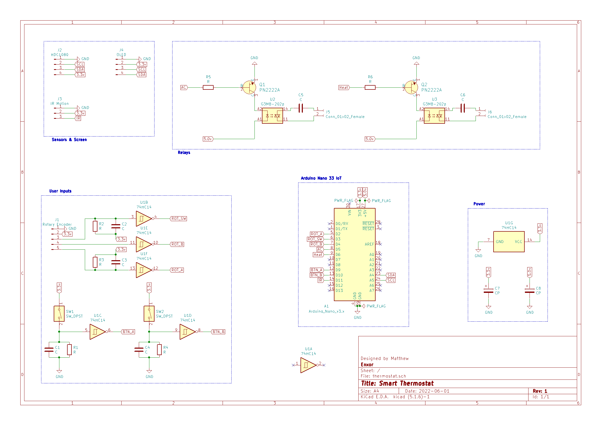
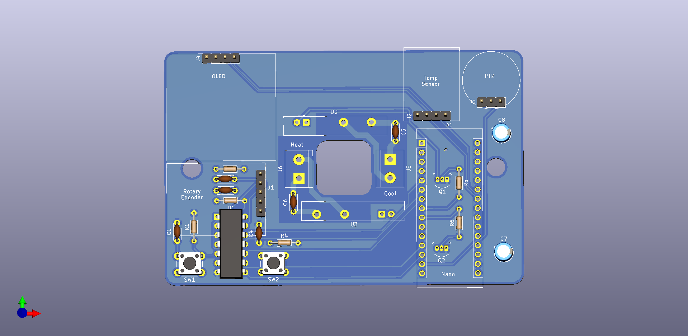
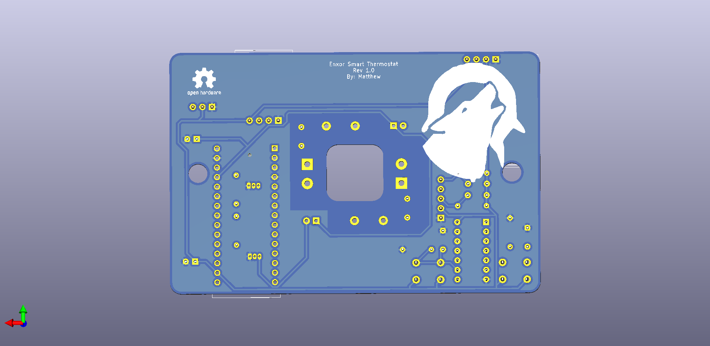

# Enxor-Smart-Thermostat
## Hardware
### By: Matthew Crump
---
## Contents
1. [Overview](#overview)
2. [General Design](#general-design)
3. [Built-in Self Test](#built-in-self-test)
4. [Wiring Diagram](#wiring-diagram)
5. [PCB Design](#pcb-design)
---
## Overview
At my duplex, I used to have a simple thermostat that used a mercury switch. I wanted to improve this by making a smart thermostat that could have a different schedule for each day of the week. As a college student at the time of creation, my schedule varied day by day. Another feature I wanted was to have the termostat automatically turn down after I had been away for a certain amount of time. The sensor data is sent to a influx database running on a Raspberry Pi. The schedule has a hard-coded default on startup but loads the server-side schedule once connected to the network. The thermostat can also show a 3-day weather forecast.
[Thermostat UI and Server Repository](https://github.com/lekgolo167/Thermostat-UI)

---
## General Design
The main event loop checks if a global queue has any items in it. Each item in the queue is a message with a corrisponding case statement block. This made it easy to connect all the classes/components together, like the OLED menu being able to change settings for the back-end. The user interface is interrupt driven, and each interrupt function adds a message to the global queue.
Timers are used to trigger sensor reading events. Which can be in intervals of 5 seconds and up to 3 minutes in-between. At each sensor reading event, the thermostat determines if the furnace should turn on based on the day's schedule or if the temperature is below the baseline. A baseline temperature is maintained if no motion has been detected for X amount of hours which is settable by the user.

## Built-in Self Test
Both the HDC1080 and HTU21D temperature sensors feature a built-in heater that can be used to test the sensor. I used a Z score value of 5 or greater to determine whether the sensor is working or not. Using a standard deviation of the sensor readings might not be the best way to know if the sesnor is working but it made it easier to do a peak detection of the sensor readings rather than just hardcoding a check that just waits for the sensor reading to go one degree from where it started.
The self test is ran once a month and helps clear off any condensation build up on the sensor package. The results of the self test (pass or fail) are logged to the server.

---
## Wiring Diagram

---
## PCB Design
Front

Back

